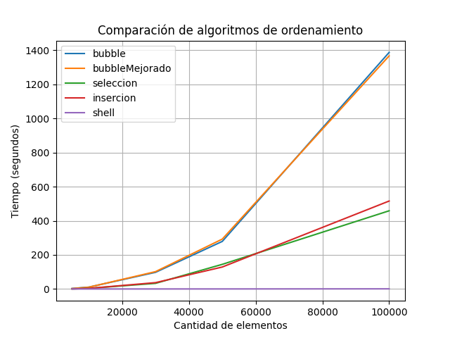

# Práctica de Algoritmos de Ordenamiento
## 📌 Información General

- **Título:** Práctica de Algoritmos de Ordenamiento
- **Asignatura:** Estructura de Datos
- **Carrera:** Computación
- **Estudiante:** Alexander Beltran, Erick Bermeo
- **Fecha:** 11/05/2025
- **Profesor:** Ing. Pablo Torres


## 🛠️ Descripción
Este proyecto implementa y compara cinco algoritmos de ordenamiento en Python:

- Método Burbuja
- Método Burbuja Mejorado
- Método Selección
- Método Inserción
- Método Shell

El programa:

- Genera arreglos aleatorios de diferentes tamaños (5000, 10000, 30000, 50000, 100000 elementos).
- Mide el tiempo de ejecución de cada algoritmo para cada tamaño.
- Genera una gráfica comparativa de los tiempos de ejecución (grafico_tiempos.png).
- Imprime los tiempos de ejecución en consola para su análisis.

El objetivo es relacionar las técnicas de ordenamiento, determinar sus diferencias en términos de eficiencia, y analizar su complejidad computacional (O(n²) para Burbuja, Selección e Inserción; O(n log n) en promedio para Shell).

## 🚀 Ejecución
## Requisitos

- Python 3.x
- Bibliotecas: matplotlib (para generar la gráfica)

- Instala las dependencias: pip install matplotlib

## Pasos para ejecutar

- Ejecuta el programa:
```
python app.py
```

- El programa generará:
Tiempos de ejecución en consola.
Una gráfica comparativa (grafico_tiempos.png) en el directorio del proyecto.

## 🧑‍💻 Ejemplo de Salida
Al ejecutar el programa, se mostrará en consola algo similar a:
- Iniciando benchmark de algoritmos de ordenamiento...

```
Tamaño: 5000, Algoritmo: bubble, Tiempo: 0.123456 segundos
Tamaño: 5000, Algoritmo: bubbleMejorado, Tiempo: 0.098765 segundos
Tamaño: 5000, Algoritmo: seleccion, Tiempo: 0.087654 segundos
Tamaño: 5000, Algoritmo: insercion, Tiempo: 0.076543 segundos
Tamaño: 5000, Algoritmo: shell, Tiempo: 0.005432 segundos
...
Tamaño: 100000, Algoritmo: bubble, Tiempo: 4.567890 segundos
Tamaño: 100000, Algoritmo: bubbleMejorado, Tiempo: 3.987654 segundos
Tamaño: 100000, Algoritmo: seleccion, Tiempo: 3.456789 segundos
Tamaño: 100000, Algoritmo: insercion, Tiempo: 3.123456 segundos
Tamaño: 100000, Algoritmo: shell, Tiempo: 0.098765 segundos

- Además, se generará una gráfica (grafico_tiempos.png) que muestra los tiempos de ejecución de cada algoritmo en función del tamaño del arreglo.
```



## Conclusiones:
- Alexander concluye que el programa fue desarrollado en lenguaje Python y permite comparar el rendimiento de distintos algoritmos de ordenamiento (burbuja, burbuja mejorada, selección, inserción y Shell) aplicados a arreglos de diferentes tamaños (especialmente arreglos grandes). A través de mediciones precisas con time.perf_counter(), se observa claramente que el algoritmo Shell, con una complejidad promedio de O(n log n), es el más eficiente para arreglos grandes, realizando sus tareas en un tiempo significativamente más rápido. En cambio, los métodos menos eficientes fueron burbuja y burbuja mejorada, ambos con complejidad O(n²), ya que sus tiempos de ejecución fueron muy altos. Por su parte, los algoritmos de inserción y selección, también con complejidad O(n²), mostraron tiempos de ejecución similares, que no fueron ni demasiado largos ni demasiado cortos. En contraste, el algoritmo Shell demuestra una eficiencia superior, con tiempos considerablemente más bajos, especialmente en arreglos grandes, debido a su menor complejidad computacional.

- Erick concluye que el proyecto, implementado en Python a través de los módulos SortMethods.py, BenchMarking.py y app.py, facilita la comparación del desempeño de cinco algoritmos de ordenamiento (burbuja, burbuja optimizada, selección, inserción y Shell) en arreglos de tamaños variados (5000 a 100000 elementos). Las mediciones de tiempo, realizadas con time.perf_counter(), revelan que el algoritmo Shell, con una complejidad promedio de O(n log n), sobresale como el más eficiente, especialmente en arreglos grandes, donde completa el ordenamiento en fracciones de tiempo mucho menores. Por el contrario, los algoritmos de burbuja y burbuja optimizada, ambos con complejidad O(n²), muestran un rendimiento pobre, con tiempos de ejecución elevados que escalan mal con el tamaño del arreglo. Los algoritmos de selección e inserción, también de complejidad O(n²), presentan un comportamiento intermedio, con tiempos aceptables pero lejos de la eficiencia del Shell. La gráfica generada en BenchMarking.py ilustra claramente la superioridad del algoritmo Shell, destacando su capacidad para manejar grandes volúmenes de datos con una complejidad computacional más favorable.

## 🔗 Repositorio
El código fuente está disponible en: https://github.com/Alexanderbl777/Icc-est-u1-TeoriaComplejidad
